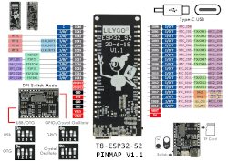

# gysol
[solarmeteo](https://github.com/androidalekra/gysol)

Hardware:
mikroprocesor ESP32S2 + nezbytné periférie [TTGO T8 ESP32-S2](http://www.lilygo.cn/prod_view.aspx?TypeId=50063&Id=1300&FId=t3:50063:3)

[modul](obrazky/ttgo_s3_t8.png)

MPPT nabíjení baterie ze solárního panelu [CN3791](https://www.laskakit.cz/solarni-nabijecka-li-ion-clanku-cn3791-1s/)

Přesný palubní čas [DS3231](https://www.laskakit.cz/arduino-rtc-hodiny-realneho-casu-ds3231-at24c32/)

Senzor měření elektrických veličin (U,I,P) solárního panelu a baterie [INA219](https://www.laskakit.cz/proudovy-senzor-3-2a--i2c--ina219/)

Senzor teploty a vlhkosti [SHT40](https://sensirion.com/products/catalog/SHT40/)

Senzor atmosférického tlaku a teploty [MS5637](https://www.te.com/usa-en/product-MS563702BA03-50.html)

Baterie Li-ion 1S 15Ah

[zapojeni](obrazky/zapojeni.png)

Motorem celého zařízení je [Micropython](https://micropython.org/)

firmware nahraný do flash s [postupem](https://micropython.org/download/ESP32_S2_WROVER/)

[Základní práce s modulem](https://docs.micropython.org/en/latest/esp32/quickref.html)

modul [web server](https://github.com/jczic/MicroWebSrv2)

